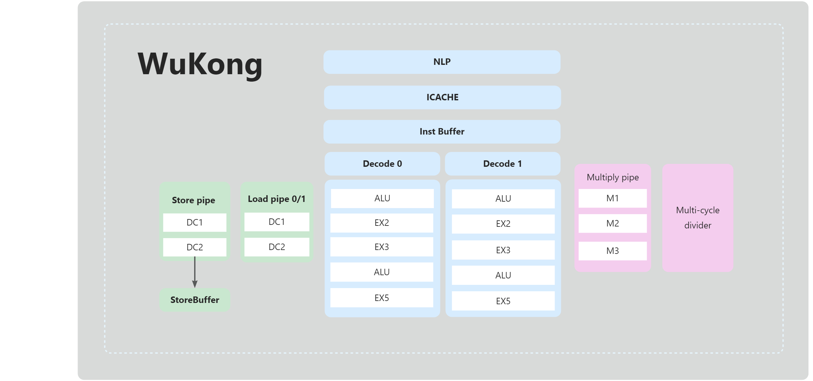

# WuKong (悟空)

WuKong(悟空) is a high-performance RISC-V based in-order processor

## Architecture

WuKong is a sequential dual-issue processor core based on the RISC-V instruction set. This design reuses XiangShan's development infrastructure and is positioned as a CPU Core with high energy efficiency ratio. It emphasizes simple design, easy modification and expansion.

Main function points:
* RV64IMAC
* Support SMP
* Support configurable ICache and DCache
* Support fast interrupt
* Support PMP
* (Optional) Support complete RISC-V privilege level, support SV39 paging mechanism
* Multi-core consistency support
WuKong borrows from Western Digital SweRV EH1 in design, and the overall structure is a nine-stage flow sequence dual-engine structure.

The processor front end (Frontend) has 3 levels, consisting of a two-level pipelined ICache, a level of instruction extension alignment, and a level of decoding.
The backend (Backend) consists of two integer execution pipelines, each pipeline has five stages, the first and fourth stages are ALU; the EX2 and EX3 stages have no actual computing functions, and are mainly responsible for operand transfer and assisting the Bypass network to complete Cache for forwarded data; EX5 class is write-back class.
In addition, the processor has three other main functional units, the branch predictor (Next-Line Predictor), the memory access processing unit (LSU) and the integer multiplication and division operation unit (MDU).

# Compile chisel code and run testbench
## build environment
* First build the Xiangshan xs-env environment, and use this warehouse instead of WuKong
* source setup.csh
## Generate support difftest version code and test the program
* source test.csh
## Generate code that supports tape-out version
* Set to SoCTestSettings in Settings.scala
* Close EnableDifftest in core.scala
* mill chiselModule.runMain top.ysyx BOARD=soctest
* Configure the SOC environment by yourself and copy the rtl slightly modified to the vsrc directory to test the tape-out program
# Notice
The SRAM currently used by the code is not the sram of the Chisel module, but replaces the SRAM used by the tape-out standard. See resources for details.